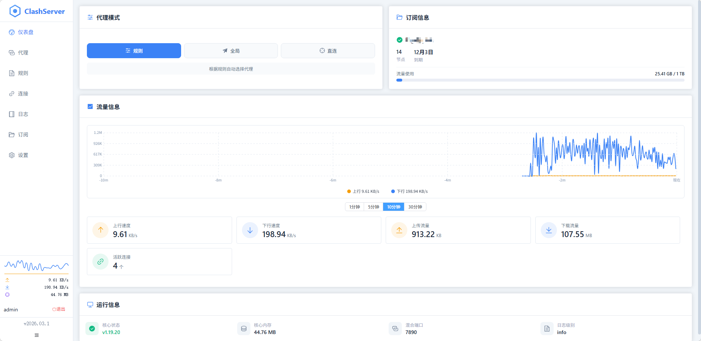
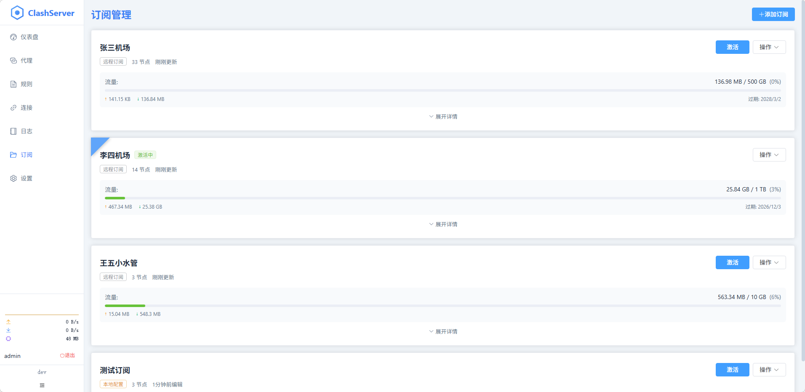
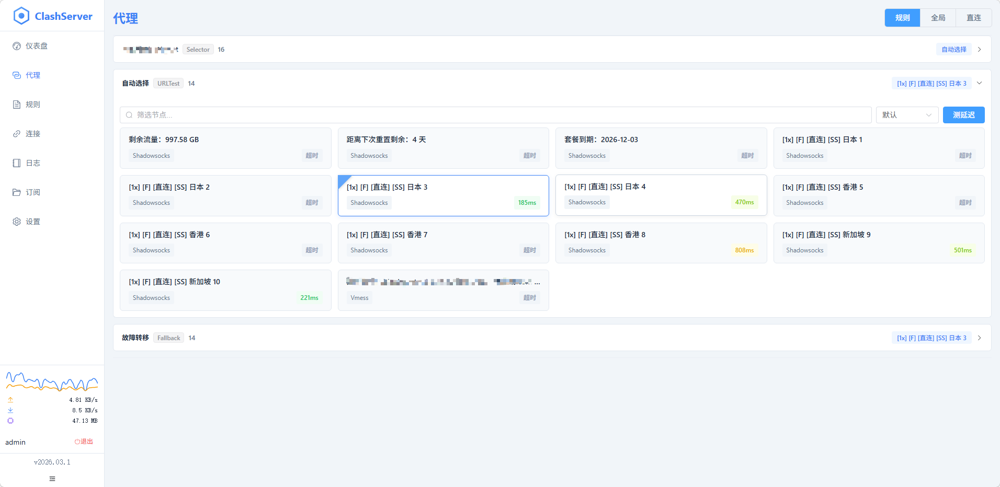
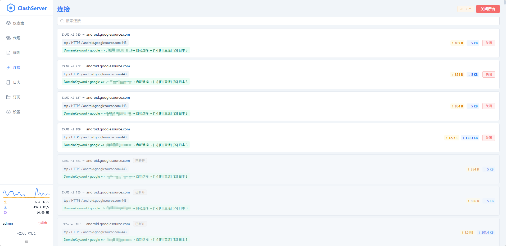
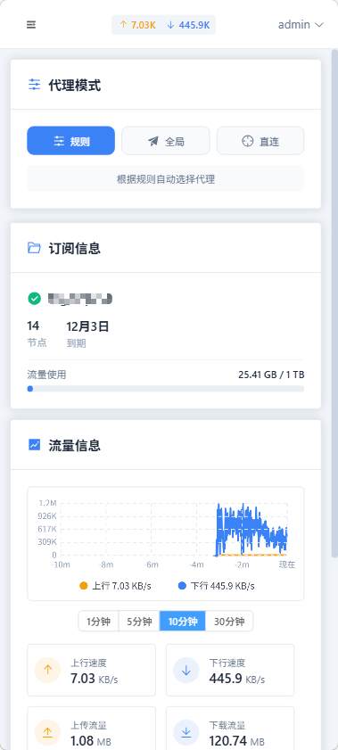
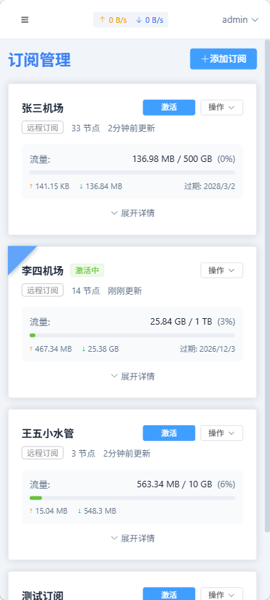
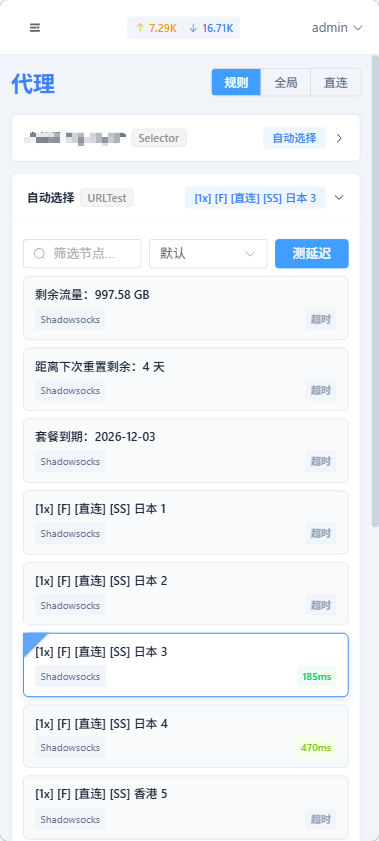
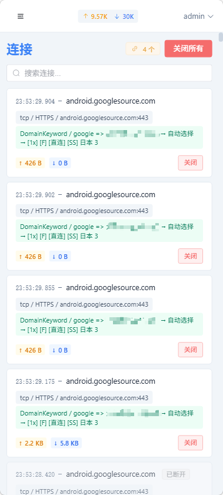

# Clash Server

[](https://opensource.org/licenses/MIT)
[](https://golang.org/)
[](https://vuejs.org/)

一个 [Mihomo (Clash Meta)](https://github.com/MetaCubeX/mihomo) 核心的 Web 管理面板。

> **Note**  
> 本项目由 [OpenCode](https://github.com/anomalyco/opencode) AI 编程助手（基于 GLM-5 模型）主要完成开发。

---

## 功能特性

### 订阅管理

- 支持远程订阅和本地配置两种来源
- 订阅自动刷新与手动刷新
- 代理更新、自定义 User-Agent、跳过证书校验
- 流量信息展示（已用/总量/过期时间）
- 激活状态管理，同一时间仅一个订阅生效

### 规则与脚本

- 为每个订阅添加自定义分流规则
- 支持 **插入模式**（优先匹配）和 **追加模式**（兜底规则）
- JavaScript 脚本处理订阅内容
- 脚本测试功能，执行前预览结果

### 代理管理

- 节点列表展示与选择
- 单节点/代理组延迟测试
- 代理模式切换（Rule / Global / Direct）

### 连接与监控

- 实时连接列表
- 断开单个/全部连接
- WebSocket 实时数据推送
  - 流量速度（上行/下行）
  - 连接状态
  - 运行日志
  - 内存占用

### 用户体验

- 深色主题
- 响应式布局（桌面/平板/手机）
- 配置热重载（无需重启核心）

---

## 截图

| 主页 | 订阅管理 |
|:---:|:---:|
|  |  |

| 代理节点 | 连接管理 |
|:---:|:---:|
|  |  |

| 主页 | 订阅管理 | 代理节点 | 连接管理 |
|:---:|:---:|:---:|:---:|
|  |  |  |  |

---

## 技术栈

| 组件 | 技术 |
|------|------|
| 后端 | Go 1.26 + Gin + GORM + SQLite |
| 前端 | Vue 3 + TypeScript + Vite 7 + Element Plus |
| 实时通信 | WebSocket |
| 脚本引擎 | [goja](https://github.com/dop251/goja) (JavaScript runtime) |

---

## 项目结构

```
clash-server/
├── server/                    # Go 后端
│   ├── cmd/server/main.go    # 入口
│   ├── internal/
│   │   ├── handler/          # HTTP handlers
│   │   ├── service/          # 业务逻辑
│   │   ├── repository/       # 数据访问
│   │   ├── model/            # 数据模型
│   │   ├── middleware/       # 中间件
│   │   ├── config/           # 配置管理
│   │   ├── ws/               # WebSocket
│   │   └── scheduler/        # 定时任务
│   ├── pkg/                  # 公共包
│   └── res/                  # 嵌入的前端资源
│
├── web/                       # Vue 前端
│   ├── src/
│   │   ├── api/              # API 请求
│   │   ├── components/       # 组件
│   │   ├── pages/            # 页面
│   │   ├── stores/           # Pinia 状态
│   │   ├── router/           # 路由
│   │   └── composables/      # 组合式函数
│   └── package.json
│
└── Makefile                   # 构建脚本
```

---

## 快速开始

### 前置要求

- Go 1.26+
- Node.js 18+（仅构建前端时需要）
- [Mihomo](https://github.com/MetaCubeX/mihomo/releases) 核心

### 构建

```bash
# 克隆仓库
git clone https://github.com/lx0758/clash-server.git
cd clash-server

# 构建（前端 + 后端）
make build
```

构建产物：`server/bin/clash-server`

### 运行

1. 确保 Mihomo 核心位于 `clash/mihomo`（仓库已包含 Linux amd64 版本）

2. 启动服务：

```bash
cd server
./bin/clash-server
```

3. 访问 http://localhost:7000

### 配置

| 配置项 | 默认值 | 说明 |
|--------|--------|------|
| Host | `0.0.0.0` | 监听地址 |
| Port | `7000` | 监听端口 |
| Database | `data.db` | SQLite 数据库文件 |

---

## Mihomo 核心

当前仓库包含 Linux amd64 版本的 Mihomo 核心。

其他平台请从 [Releases](https://github.com/MetaCubeX/mihomo/releases) 下载对应版本：

| 平台 | 文件名 |
|------|--------|
| Linux arm64 | `mihomo-linux-arm64` |
| macOS amd64 | `mihomo-darwin-amd64` |
| macOS arm64 | `mihomo-darwin-arm64` |
| Windows amd64 | `mihomo-windows-amd64.exe` |

下载后重命名为 `mihomo`，放入 `clash/` 目录。

---

## 开发

```bash
# 后端开发服务
cd server && make dev

# 前端开发服务（另一个终端）
cd web && npm install && npm run dev
```

---

## 致谢

本项目由 [OpenCode](https://github.com/anomalyco/opencode) AI 编程助手搭配 [智谱 GLM-5](https://www.zhipuai.cn/) 模型完成功能开发。

OpenCode 负责了：

- 需求分析与规格定义
- 架构设计与实现
- 前后端代码编写
- 功能迭代与优化

感谢 OpenCode 团队和智谱 AI 提供的强大工具。

---

## 许可证

[MIT](LICENSE)
